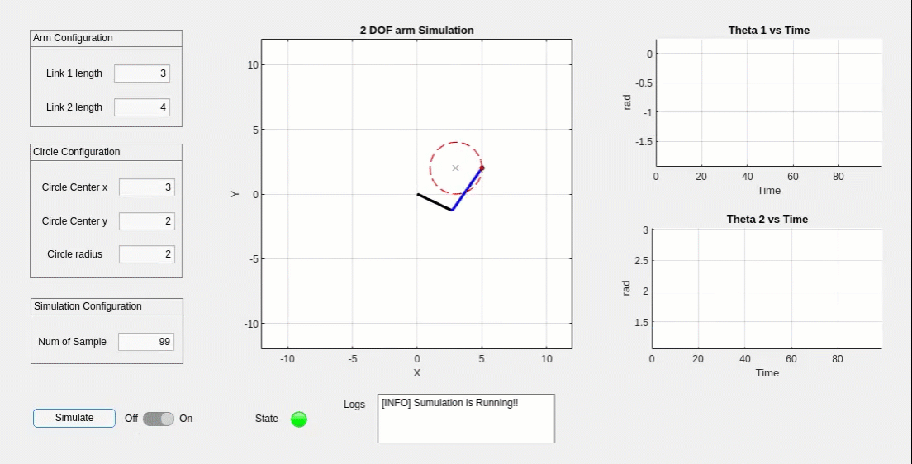

# 2-DOF Arm Simulation


## Overview

This MATLAB script simulates the motion of a 2-DOF robotic arm in a 2D space using a GUI. The simulation enables users to define the arm geometry and specify a circular path for the end effector.

## Run Simulation

Write the following command into the MATLAB command window:

```matlab
armSimGUI
```


## Notes

- Be careful when configure the circle's position (x, y) and radius to ensure that the subsequent inverse kinematics calculations for theta1 and theta2 yield valid and real values within the specified arm geometry

## To-Do

- [ ] Plot all reachable positions of the end effector in the workspace.

## Referances

- [Inverse Kinematics for a 2-Joint Robot Arm](https://robotacademy.net.au/lesson/inverse-kinematics-for-a-2-joint-robot-arm-using-geometry/) by Professor Peter Corke.


